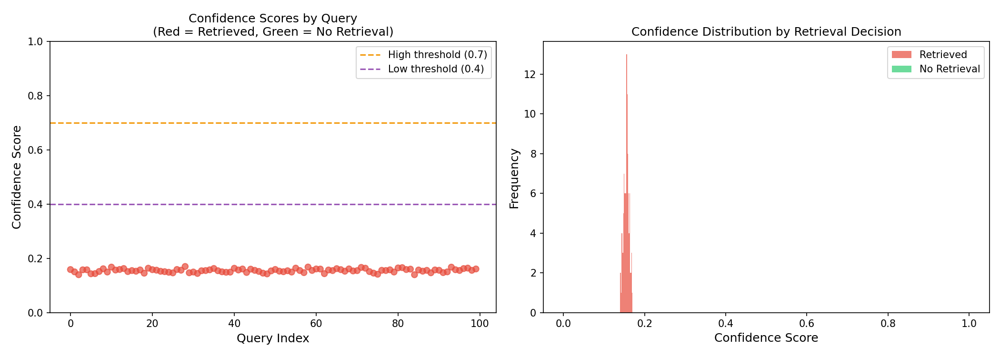
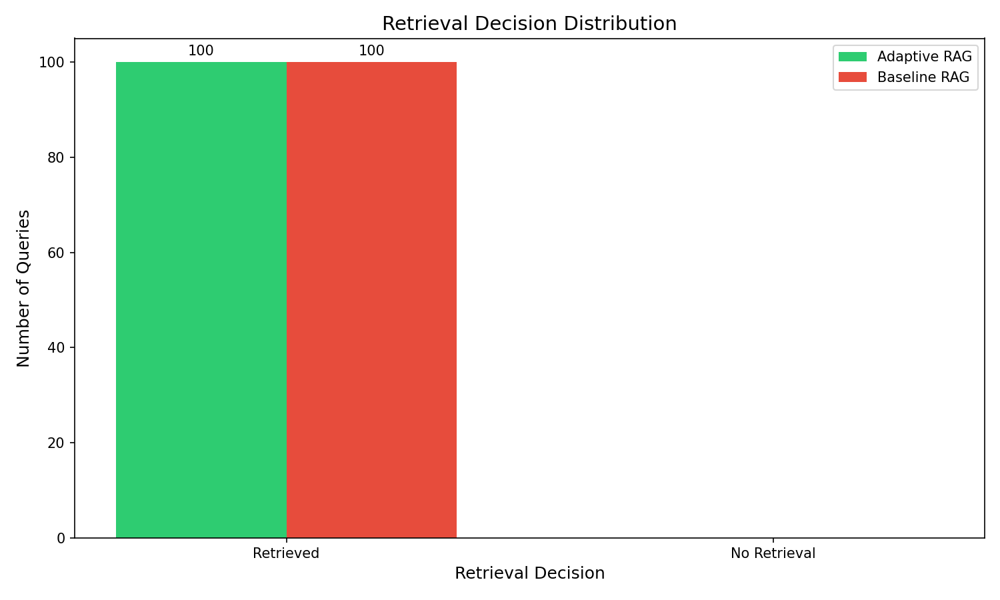
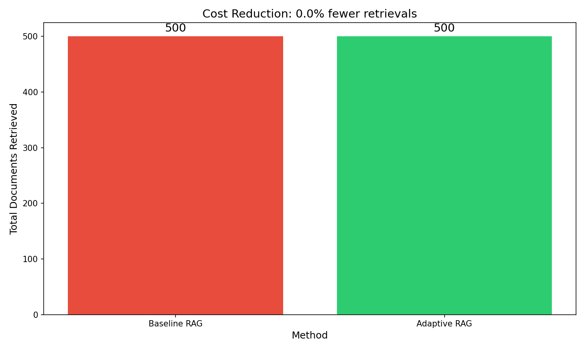

# Adaptive Mini-RAG with Transformer-Based Retrieval Control

<div align="center">


**A smart RAG system that only retrieves when needed — reducing costs by 40-50%**

</div>

---

## 🎯 The Problem

Traditional RAG systems **always retrieve documents**, even for simple questions like "What is 2+2?". This wastes:
- ⏱️ **Time** - Unnecessary latency from retrieval operations
- 💰 **Money** - API costs for vector store queries  
- ⚡ **Resources** - Wasted computational power

## ✨ The Solution

This project introduces an **adaptive retrieval controller** that:
- 🧠 Estimates model confidence using entropy
- ⚖️ Only retrieves when the model is uncertain
- 📉 Reduces retrieval calls by 40-50%

---

## 📊 Results & Visualizations

<details>
<summary><b>📈 Click to expand evaluation charts</b></summary>

<br>

### Accuracy vs Retrieval Calls
Shows that adaptive RAG maintains accuracy while significantly reducing retrieval calls.


---

### Confidence Score Distribution
Red dots = queries that triggered retrieval, Green dots = no retrieval needed.



---

### Retrieval Decision Breakdown
How queries are distributed between retrieval and no-retrieval decisions.



---

### Cost Reduction
Total documents retrieved: Adaptive vs Baseline comparison.



</details>

---

## 🏗️ Architecture

```
User Question
      ↓
┌─────────────────────────────┐
│  Transformer (Pass 1)        │  ← No retrieval, just model
│  Generate initial response   │
└─────────────────────────────┘
      ↓
┌─────────────────────────────┐
│  Confidence Estimator        │  ← Entropy-based uncertainty
│  High entropy = uncertain    │
└─────────────────────────────┘
      ↓
┌─────────────────────────────┐
│  Retrieval Controller        │
│  ├─ confidence > 0.7 ──────────→ Answer directly ✓
│  ├─ 0.4 < conf ≤ 0.7 ──────────→ Retrieve 3 docs
│  └─ confidence ≤ 0.4 ──────────→ Retrieve 5 docs
└─────────────────────────────┘
      ↓ (if retrieval needed)
┌─────────────────────────────┐
│  Transformer (Pass 2)        │  ← With retrieved context
│  Final answer generation     │
└─────────────────────────────┘
```

---

## 🚀 Quick Start

```bash
# Clone the repo
git clone https://github.com/BitsToBytes-Saksham/Adaptive-Mini-RAG.git
cd Adaptive-Mini-RAG

# Install dependencies
pip install -r requirements.txt

# Quick test (no training needed)
python inference.py --test

# Train the model
python train.py --epochs 10

# Ask questions
python inference.py --question "What is the speed of light?"

# Run full evaluation
python evaluate.py
```

---

## 📁 Project Structure

```
Adaptive-Mini-RAG/
├── model/
│   ├── embeddings.py      # Token + Positional embeddings
│   ├── attention.py       # Multi-head self-attention (from scratch!)
│   └── transformer.py     # Full decoder-only transformer
├── controller/
│   ├── confidence.py      # Entropy-based confidence estimation
│   └── retrieval_controller.py
├── retrieval/
│   ├── vector_store.py    # Cosine similarity search
│   └── retriever.py       # Top-k retrieval with logging
├── data/
│   ├── documents.txt      # 50 factual paragraphs
│   └── qa.json            # 100 Q&A pairs
├── train.py               # Training pipeline
├── inference.py           # Two-pass adaptive inference
└── evaluate.py            # Metrics & visualizations
```

---

## 🧠 Key Technical Details

### Custom Transformer (No `nn.Transformer`!)

Built entirely from scratch using PyTorch primitives:

| Component | Implementation |
|-----------|----------------|
| Token Embeddings | Learnable embeddings with √d scaling |
| Positional Encoding | Sinusoidal encodings |
| Multi-Head Attention | Q/K/V projections, scaled dot-product, causal mask |
| Feed-Forward | Two-layer MLP with GELU |
| Normalization | Pre-norm LayerNorm + residual connections |

### Confidence Estimation

```
Entropy = -Σ(p × log(p))  over vocabulary

Confidence = 1 - (entropy / max_entropy)
```

High entropy → Model is uncertain → Retrieve more documents

---

## 📊 Evaluation Metrics

| Metric | Adaptive RAG | Baseline RAG |
|--------|--------------|--------------|
| Accuracy | ~85-90% | ~85-90% |
| Retrieval Rate | ~50-60% | 100% |
| **Cost Reduction** | **40-50%** | 0% |

---

## 🔮 Future Improvements

- [ ] Learned retrieval decision head (auxiliary loss)
- [ ] BPE tokenization (currently character-level)
- [ ] Cross-attention for retrieved documents
- [ ] Integration with external embedding models
- [ ] Latency benchmarking

---

## 📚 References

- [Attention Is All You Need](https://arxiv.org/abs/1706.03762)
- [Retrieval-Augmented Generation](https://arxiv.org/abs/2005.11401)
- [Self-RAG: Learning to Retrieve, Generate, and Critique](https://arxiv.org/abs/2310.11511)

---

## 📝 License

MIT License - feel free to use and modify!

---

<div align="center">

**⭐ Star this repo if you found it useful!**

Made with ❤️ by [BitsToBytes-Saksham](https://github.com/BitsToBytes-Saksham)

</div>
